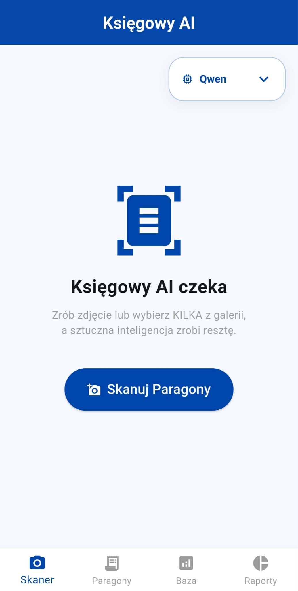
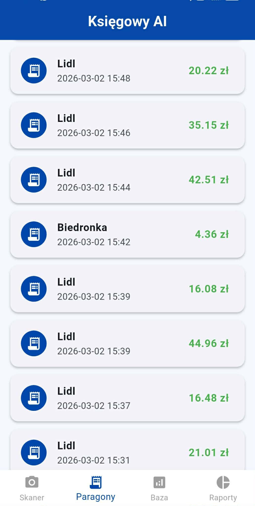
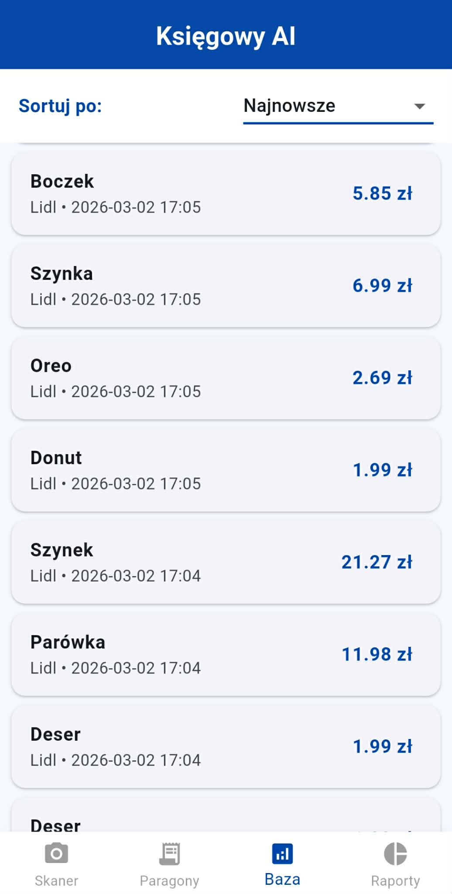
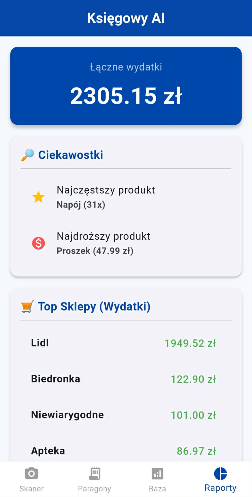
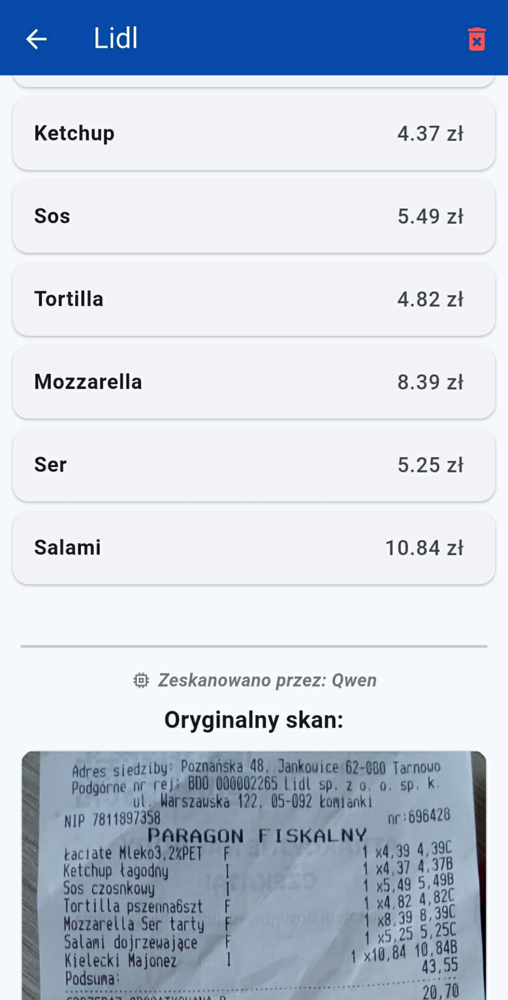

# 🧾 Księgowy AI - Skaner i Analizator Paragonów

> ⚠️ **Projekt PoC (Proof of Concept)**
> Aplikacja demonstracyjna służąca do testowania możliwości małych modeli wizyjno-językowych (VLM) w zadaniu wyciągania ustrukturyzowanych danych z polskich paragonów. 

Projekt składa się z aplikacji mobilnej oraz chmurowego backendu (Serverless GPU). Celem systemu jest odczytanie zdjęcia paragonu, odfiltrowanie zbędnych informacji (np. gramatury, marki produktów) i zwrócenie czystego pliku JSON z listą zakupów, datą i kwotą.

---

## 📸 Podgląd

<div align="center">
  
  
  
  
  
</div>

---

## 🚀 Główne cechy projektu

* **Własny Dataset i Narzędzia:** Stworzenie dedykowanego programu okienkowego (Python/Tkinter/OpenCV) do szybkiego oznaczania, docinania i formatowania danych treningowych z paragonów.
* **Fine-Tuning Modeli VLM:** Wytrenowanie własnych adapterów (LoRA/PEFT) dla modeli **Qwen2-VL (2B)** oraz **PaliGemma (3B)** na przygotowanym zbiorze danych.
* **Smart Cropping (Mobile):** Aplikacja mobilna automatycznie wykrywa krawędzie paragonu i wycina stół/tło, co ułatwia pracę modelom AI (redukcja szumu).
* **Architektura Serverless:** Backend hostowany w chmurze Modal. Karty graficzne (NVIDIA T4) są uruchamiane dynamicznie tylko na czas trwania zapytania.
* **Wybór silnika AI:** Interfejs aplikacji pozwala na płynne przełączanie się między wytrenowanymi modelami w celu porównywania ich skuteczności.

---

## 🛠️ Stack Technologiczny

* **Aplikacja Mobilna:** Flutter, Dart, SQLite (do lokalnego zapisu historii).
* **Backend i Chmura:** Python, FastAPI, platforma Modal.
* **Machine Learning:** PyTorch, Transformers (Hugging Face), PEFT, Accelerate.
* **Narzędzia lokalne (Data Prep):** Tkinter, OpenCV, Pillow.

---

## 📂 Struktura Repozytorium

```text
Ksiegowy_AI_Project/
├── mobile_app/                 # Kod źródłowy aplikacji (Flutter)
├── cloud_backend/              # API i wdrożenie na chmurę Modal (Python)
│   ├── app.py
│   └── requirements.txt
└── ai_training_and_tools/      # Narzędzia do budowy datasetu i skrypty uczące
    ├── trenuj_qwena.py
    ├── trenuj_paligemme.py
    └── weryfikator_json.py     # Autorski program GUI do weryfikacji datasetu
